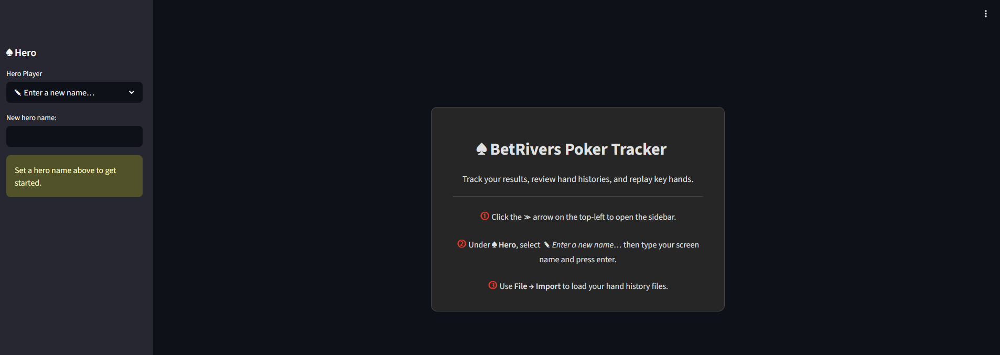
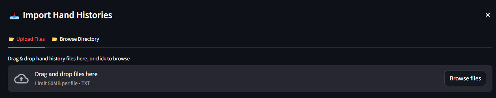
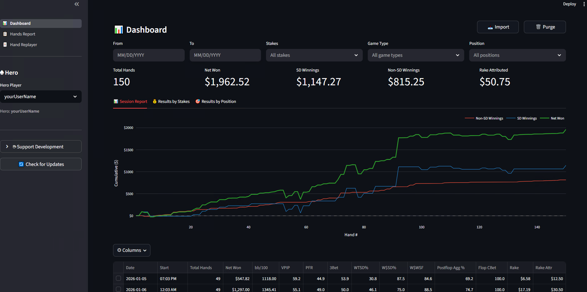
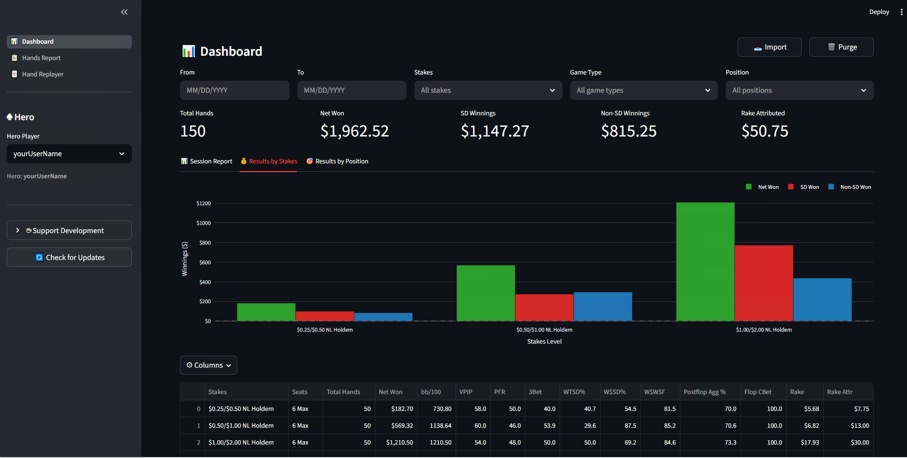
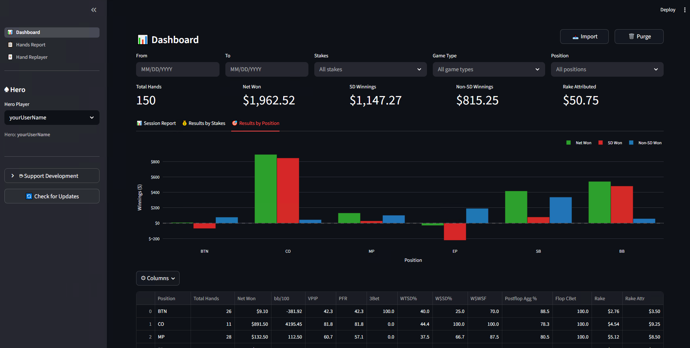
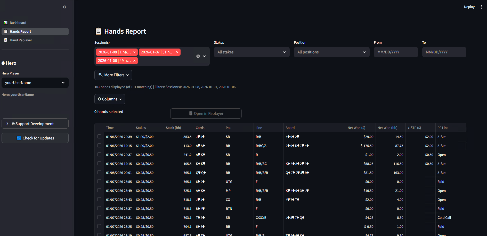
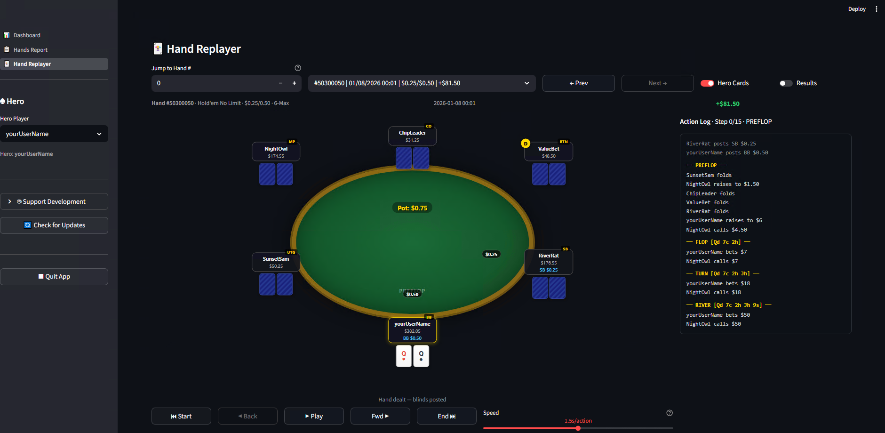
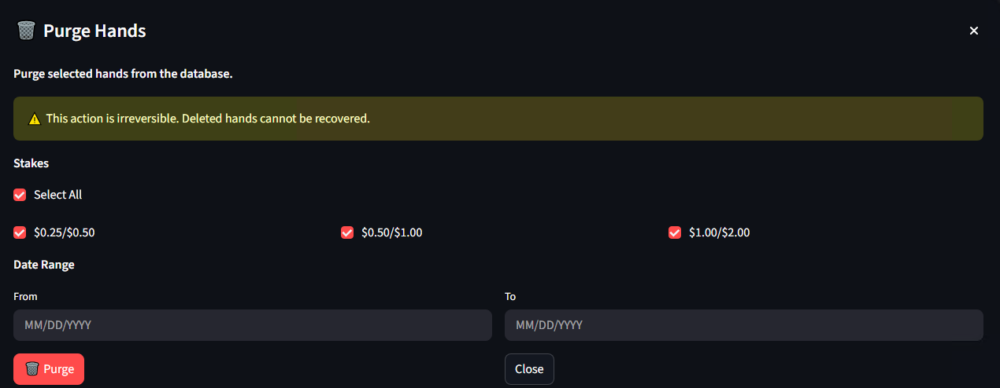

# BetRivers Poker Tracker — User Guide

This guide walks through every major feature of the app with annotated screenshots.

---

## Table of Contents

1. [Welcome Page — Getting Started](#1-welcome-page--getting-started)
2. [Importing Hand Histories](#2-importing-hand-histories)
3. [Dashboard — Session Report](#3-dashboard--session-report)
4. [Dashboard — Results by Stakes](#4-dashboard--results-by-stakes)
5. [Dashboard — Results by Position](#5-dashboard--results-by-position)
6. [Hands Report](#6-hands-report)
7. [Hand Replayer](#7-hand-replayer)
8. [Purging Hands](#8-purging-hands)

---

## 1. Welcome Page — Getting Started

When you launch BetRivers Poker Tracker for the first time, you'll see a welcome card in the center of the screen with three setup steps.

The sidebar on the left shows the **Hero Player** section where you need to create a screen name (your poker alias).

### Setup Steps

Follow these three simple steps to get started:

**① Open the Sidebar**
Click the **≫** arrow on the top-left to open the sidebar if it's not already visible. The sidebar contains the Hero Player controls.

**② Create a Hero Name**
Under the **♠ Hero** section in the sidebar, click on the **✎ Enter a new name…** dropdown menu. Type your screen name (the name you use at the poker tables) and press **Enter**. This name will be used to identify your hands and stats throughout the app.

**③ Import Your Hand Histories**
Once you've set a hero name, use **File → Import** (or the Import button in the top-right) to load your hand history files. You can upload individual `.txt` files or point the app at a folder containing multiple hand histories. The app will automatically parse and load your hands.

Once you've completed these steps, you'll see the Dashboard with your poker statistics.

---

## 2. Importing Hand Histories

Open the **Import** dialog from the **Import** button in the top-right corner of any page.

- **Upload Files tab** — Drag and drop one or more `.txt` hand history files directly onto the drop zone, or click **Browse files** to open a file picker. Files are limited to 50 MB each.
- **Browse Directory tab** — Point the app at a local folder and it will scan for all `.txt` hand histories in that directory.

After upload, the app parses each file and loads new hands into the database. Duplicate hands are skipped automatically, so you can safely re-import the same file.

---

## 3. Dashboard — Session Report

The **Dashboard** is the app's home page and gives a high-level summary of your results.

### Filter Bar

At the top you can narrow down your data by:

| Filter | Description |
|--------|-------------|
| **From / To** | Date range |
| **Stakes** | Limit results to specific blind levels |
| **Game Type** | Hold'em No Limit, etc. |
| **Position** | Filter by seat position (BTN, CO, SB, …) |

### Summary Stats

Five headline numbers show the totals for the current filter selection:

| Metric | Description |
|--------|-------------|
| **Total Hands** | Number of hands played |
| **Net Won** | Total profit/loss in dollars |
| **SD Winnings** | Winnings from hands that reached showdown |
| **Non-SD Winnings** | Winnings from hands won without showdown |
| **Rake Attributed** | Rake paid (attributed to hero) |

### Session Report Tab

The **Session Report** chart plots cumulative **Net Won**, **SD Winnings**, and **Non-SD Winnings** over hand number, so you can see how your results trended within and across sessions.

Below the chart is a session-by-session breakdown table with columns for date, start time, hand count, and key stats (bb/100, VPIP, PFR, 3Bet, WTSD%, W$SD%, W$WSF, Postflop Agg%, Flop CBet, Rake, and Rake Attr). Click **Columns** to show or hide individual columns.

---

## 4. Dashboard — Results by Stakes

Click the **Results by Stakes** tab to see a grouped bar chart comparing **Net Won**, **SD Won**, and **Non-SD Won** at each blind level you've played ($0.25/$0.50, $0.50/$1.00, $1.00/$2.00, etc.).

The table below breaks down the same figures per stakes level and includes seats, hand count, bb/100, and the full suite of stat columns.

---

## 5. Dashboard — Results by Position

The **Results by Position** tab shows a grouped bar chart of **Net Won**, **SD Won**, and **Non-SD Won** broken down by seat position (BTN, CO, MP, EP, SB, BB).

The accompanying table lets you quickly see which positions are your most (and least) profitable, along with VPIP, PFR, 3Bet, showdown stats, and aggression metrics for each seat.

---

## 6. Hands Report

Navigate to **Hands Report** in the sidebar to browse individual hands.

### Filters

- **Session(s)** — Multi-select pill selector lets you pick one or more sessions by date. Selected sessions appear as removable tags.
- **Stakes** — Filter by blind level.
- **Position** — Filter by your seat at the table.
- **From / To** — Date range picker.
- **More Filters** — Expands additional filter options.

The status bar below the filters shows how many hands match the current selection (e.g., *101 hands displayed (of 101 matching)*).

### Hands Table

Each row represents one hand and shows:

| Column | Description |
|--------|-------------|
| **Time** | Hand timestamp |
| **Stakes** | Blind level |
| **Stack (bb)** | Your stack in big blinds |
| **Cards** | Your hole cards |
| **Pos** | Your position |
| **Line** | Street-by-street action line (R/B/BC, etc.) |
| **Board** | Community cards |
| **Net Won ($)** | Dollar result |
| **Net Won (bb)** | Result in big blinds |
| **STP ($)** | Splash the Pot amount |
| **PF Line** | Preflop action label (Open, 3-Bet, Cold Call, Fold, …) |

Click **Columns** to customise which columns are displayed. Select one or more hands using the checkboxes, then click **Open in Replayer** to load them directly into the Hand Replayer.

---

## 7. Hand Replayer

The **Hand Replayer** lets you step through any hand action by action.

### Navigation

- Use the **Jump to Hand #** box (with **−** / **+** buttons) to jump straight to a hand by its sequence number.
- Use the **hand selector dropdown** to pick a specific hand by ID, date, and stakes.
- **← Prev** / **Next →** move through hands one at a time.

### Table View

The felt shows all players at the table with their screen names, stack sizes, position labels, and hole cards (face-down for opponents). The pot amount is displayed in the centre.

### Playback Controls

| Control | Action |
|---------|--------|
| **⏮ Start** | Jump to the beginning of the hand |
| **◄ Back** | Step back one action |
| **► Play** | Auto-play through the hand |
| **Fwd ►** | Step forward one action |
| **⏭ End** | Jump to the end of the hand |
| **Speed** | Slider to control auto-play speed (seconds per action) |

### Toggles

- **Hero Cards** — Show or hide your hole cards on the felt.
- **Results** — Reveal the final outcome and winnings for all players.

### Action Log

The panel on the right lists every action in the hand grouped by street (PREFLOP, FLOP, TURN, RIVER), making it easy to follow along even when replaying quickly.

---

## 8. Purging Hands

Click **Purge** in the top-right corner to permanently delete hands from the database.

> **Warning:** This action is irreversible. Deleted hands cannot be recovered.

### Options

- **Stakes checkboxes** — Select which blind levels to purge. Use **Select All** to toggle all stakes at once.
- **Date Range (From / To)** — Optionally restrict the purge to a specific date window. Leaving both fields blank purges all hands at the selected stakes.

Click **Purge** to execute, or **Close** to cancel without making any changes.
